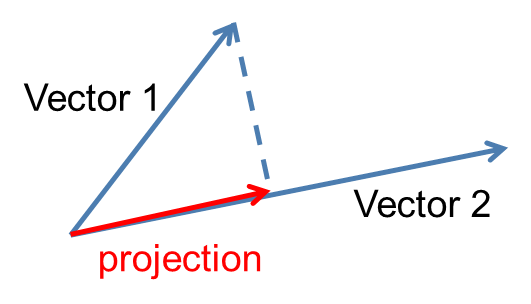

**Intro**

Why do we want to project vectors onto spaces. The simplest answers to this quesion is that we want to approximate or have a best solution to equation Ax = b when there is no solution to it. When you have many data points/equations but fewer variables there is no solution to the equation. Meaning dimension of left null space (m-r for a $A_{mxn}$ matrix) being at least 1. Because if this was not the case we would be on the column space and wouldn't need a projection to begin with.

Let's start with a 2D example for visualization and better understanding:

Let:

- a: Vector2
- b: Vector1
- p: projection

From the figure we can see that projection is just a vector on a which means it is a multiple of a:

$p = xa$

The dotted line, the cloesest distance from b to a, which we will call error can be then defined as:

$e = b - ax$

We know that if two vectors are perpendicular then their dot product should be 0:

\begin{equation}
\begin{aligned}
&a^T(b - ax) = 0\\\\
&a^Tb = a^Tax\\\\
&\hat{x} = \frac{a^Tb}{a^Ta}
\end{aligned}
\end{equation}

Knowing that $p = ax$ then $p = a\frac{a^Tb}{a^Ta}$, and $\hat{x}$ is our best approximation to x with minimum error.

Of course this is the case for rank 1 matrices or vectors in other words. For greater dimensions we need to introduce to matrix form.

Let:

- A be the matrix in equation $A\hat{x} = p$
- P be the proejction matrix that acts on b and gives us the projection p, $Pb = p$

Then we can introduce the error and the other equations as follows:

- e = b - Ax

- $A^T(b- Ax) = 0$

- $A^Tb = A^TAx$

- $\hat{x} = (A^TA)^{-1}A^Tb$

The final equation is our least squares approximation, then:

- $p = A(A^TA)^{-1}A^Tb$

- $P = A(A^TA)^{-1}A^T$

Notice that projection matrix P lives in column space of A since any linear combination of a matrix will live in the same column space. Also, notice that the error vector (b - Ax) which is perpendicular A lives in the left null space of A, $N(A^T)$.

