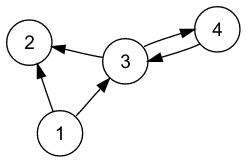

**1) Intro** 

PageRank is an algorithm or a sequential equation to compute the probabilistic view of steady states in a directed graph. These steady states (probabilities) eventually represents the ranks of each node in our graph model.

**Directed Graphs:** If the way of the relationship between nodes matter. E.g., user a follows user b but user b doesn't follow user b. (We will use this case for PageRank)

**Undirected Graphs:** If the way of the relationship between nodes doesn't matter. Distances between cities A-B, B-C, C-D, ..., Y-Z.

Now let's imagine each node represents a website and each arrow represents a link from a certain website to another. Here the idea is that a link towards a website is like reference and having a link from a more popular website is better.

**2) Matrix Represantation of the Graph**

For simplicity eventhough the web and a real network has millions of rows we will use Figure 1 as our dummy example.

Now to represent the idea in eqautions, first we will construct a column stochastic matrix (which has elements sum up to 1 in each column). In this transition matrix probability of from going one node to another node would be equally likely. 

\begin{equation}
 A = 
  \begin{bmatrix}
    0 & 0 & 0  & 0     \\
    \frac{1}{2}  & 0 & \frac{1}{2} & 0 \\
    \frac{1}{2} & 0 &  0 & 1 \\
    0  & 0 & \frac{1}{2}& 0  
  \end{bmatrix}
\end{equation}

**3) Idea behind the ranks**

Now, that we have the transition matrix with each element representing the probability of going from one node to another. Here, we try to understand the probabilities in the steady state (when probabilities don't change). Or in other words the probabilities of me ending up at either node in infinity. 

Let v be the initialization vector, the probability of being in either node at t = 0. 
Then we can have v as;

\begin{equation}
 v = 
  \begin{bmatrix}
    \frac{1}{4}\\
    \frac{1}{4}\\
    \frac{1}{4}\\
    \frac{1}{4}
  \end{bmatrix}
\end{equation}

Steps we will take until convergences will be as the following:

$Av , A(Av), A(A^2v), ...., A^kv$

We can say that we are at convergence when $A^{k-1}v$ and $A^kv$ are equal.

**4) Eigenvalues and Eigenvectors**

From our transition matrix A we can write the following equations:

\begin{equation*}
\begin{aligned}
x_1 = 0x_1 + 0x_2 + 0x_3 + 0x_4\\\\
x_2 = 1/2x_1 + 0x_2 + 1/2x_3 + 0x_4\\\\
x_3 = 1/2x_1 + 0x_2 + 0x_3 + 1x_4\\\\
x_4 = 0x_1 + 0x_2 + 1/2x_3 + 0x_4\\\\
\end{aligned}
\end{equation*}

\begin{equation}
  A 
  \begin{bmatrix}
    x_1\\
    x_2\\
    x_3\\
    x_4
  \end{bmatrix}
   = 
   \begin{bmatrix}
    x_1\\
    x_2\\
    x_3\\
    x_4
  \end{bmatrix}
\end{equation}

Which means that our convergence vector is nothing but the eigenvector of eigenvalue $\lambda = 1$.  

**5) What happens if we try to find ranks for graph A? (Dangling Nodes)**

\begin{equation*}
Av = 
\begin{bmatrix}
0\\
0.25\\
0.375\\
0.125\\
\end{bmatrix}
A^2v = 
\begin{bmatrix}
0\\
0.1875\\
0.125\\
0.1875\\
\end{bmatrix}
...
A^{100}v = 
\begin{bmatrix}
0\\
0\\
0\\
0\\
\end{bmatrix}
\end{equation*}

This problem is referred as dangling node problem, since there is no link from node 2 when we arrive there there is no way out. A simplistic solution to this problem is to create equal links from the dangling nodes to every other node in the system. This way we will have a converged stochastic solution without affecting the overall importance of each node.

Modified A as $A^*$:

\begin{equation}
 A^* = 
  \begin{bmatrix}
    0 & \frac{1}{4} & 0  & 0     \\
    \frac{1}{2}  & \frac{1}{4} & \frac{1}{2} & 0 \\
    \frac{1}{2} & \frac{1}{4} &  0 & 1 \\
    0  & \frac{1}{4} & \frac{1}{2}& 0  
  \end{bmatrix}
\end{equation}

The converged solution:

\begin{equation}
A^{*100}v = 
  \begin{bmatrix}
    0.074\\
    0.296\\
    0.370\\
    0.259\\
  \end{bmatrix}
\end{equation}

**6) What if there are groups of websites that are not linked in any way?**

This is the problem of disconnected components and the case of almost all real life graphs.

Here, 1-2 and 3-4 are connected but there is no way from 1-2 to 3-4 and vice versa.

\begin{equation}
 A = 
  \begin{bmatrix}
    0 & 1 & 0  & 0     \\
    1 & 0 & 0 & 0 \\
    0 & 0 &  0 & 1 \\
    0  & 0 & 1 & 0  
  \end{bmatrix}
\end{equation}

This is where we introduce Google matrix as:

\begin{equation}
M = (1 - p)A + pB
\end{equation}

\begin{equation}
B = \frac{1}{n}
  \begin{bmatrix}\\
    1 & 1 &...&  1\\
    . & . & ... & 1 \\
    . & . & ... & 1 \\
    1  & 1 & ... & 1  
  \end{bmatrix}
\end{equation}

Here M is a weighted averaged matrix of original A and B. This equation states that when crawling web going in between disconnected nodes is an event with $\frac{1}{n}$ probability.

**Important Properties by Perron-Frobenius Theorem**

- M is positive and column stochastic.
- M has eigenvalue 1 as it's largest eigenvalue. 
- M has one unique eigenvector with sum of entries equal to 1.

After computing M all we need to do is to find the converged solution as we did at the beginning. One should be careful about dangling nodes, and M to be positive column stochastic.

